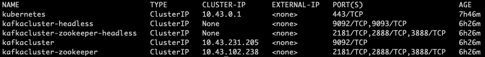
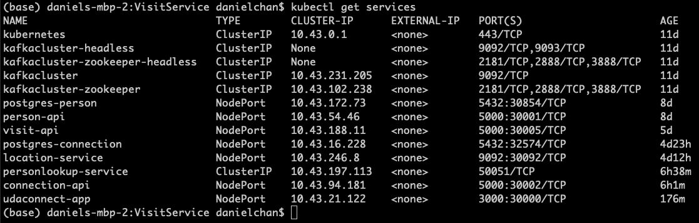

# Architecture Design

The business requirement is to build a MVP that can ingest a large volume of location data from mobile devices and use an existing set of micro services to identify individuals who have shared a close geographic proximity. 

I have built three additional services to support this objective. Location data from mobile devices are ingested by the Visit REST API endpoint and routed to the Kafka server asynchronously so users would not have to wait for the time-consuming data persisting process to complete in the database.  Kafka has the capability to scale up to several GB/sec bandwidth and incur less than 30 ms latency therefore justifying its use for processing large volume of data. LocationService persists location data  in PostgresSQL through a post REST call to the Connection endpoint in the order they are consumed from Kafka. Effectively, we are using Kafka to hide the latency and contention caused by database insert operations. 

Since Connection and Person are now 2 separate micro services, Connection needs to use message passing to fetch Person data from its database. PersonLookup service is the conduit. It caches person data from Person first and then serves them out on demand using gRPC protocol which has a higher performance than REST and can be multithreaded for better scalability. 


# Launch Kafka cluster

Helm is a simple way to launch a Kafka cluster in Kubernetes:

```
helm repo add bitnami https://charts.bitnami.com/bitnami
helm install kafkacluster bitnami/kafka   --set volumePermissions.enabled=true   --set zookeeper.volumePermissions.enabled=true
```

After a minute or so, we can check whether each service is running correctly by using

```
kubectl get services
```

the terminal output should look something  likes this



to test if we can produce and consume messages to and from the Kafka cluster correctly, we need to start the Kafka client in a pod first 

```
kubectl run kafkacluster-client --restart='Never' --image docker.io/bitnami/kafka:2.8.0-debian-10-r43 --namespace default --command --sleep infinity
    
kubectl exec --tty -i kafkacluster-client --namespace default -- bash
```

at the command prompt, we run the predefined producer script using

```
kafka-console-producer.sh --broker-list kafkacluster-0.kafkacluster-headless.default.svc.cluster.local:9092 --topic test
```

a '>' prompt show appear. At this point, we can start entering data to send to the cluster, hit CRTL + c to terminate.

To consume the data just produced above, we can use the following script

```
kafka-console-consumer.sh --bootstrap-server kafkacluster.default.svc.cluster.local:9092 --topic test --from-beginning

```

One additional check is to ascertain all the pods are running and look healthy using the following command

```
kubectl get po
```

The output should look like this:


# Deploy Services

Each of the five services ( Person, PersonLookup, Connection, Location, Visit) and the frontend application has it's own folder under the /modules directory, in this folder, there is a deployment subfolder where all the necessary YAML files reside. For instance, to deploy the Connect service, we would go to the /modules/ConnectionService and  execute the following commands to spin up both the pod and service for API and postgres database.

```
kubectl apply -f deployment/connection-api.yaml 

kubectl apply -f deployment/postgres-connection.yaml
```

We can also use the data and shell scripts in the /db and /scripts folder to setup the database table header and seed data.

After everything is deployed, pods in the Kubenetes cluster should look like the following:


and the cluster will contain a set of services described below:



# Run the application

To run the application, we can open a browser and point to the URL http://localhost:30000/ and reach the following user interface. Clicking at individual name will show that person's connection(s) at specified time range and geographical proximity.


All REST API's have live Swagger documentation. For Person service, it is located at localhost:30001, for Connection service it is on port:30002 and port 30005 for visit which has this output:


Instead of using Postman to test the REST APIs, I chose Thunder Client which is a Visual Studio Code extension and is much simpler to use. To ingest new location data, I would post them to the URL http://localhost:30005/api/visits. The Thunder Client's user interface looks like this:


