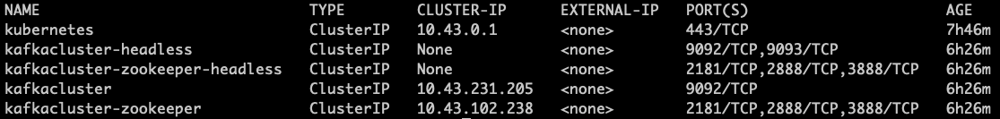
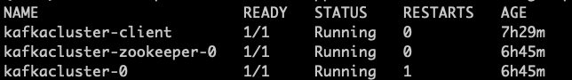

# Start Kafka cluster

A simple way to launch a Kafka cluster is to use helm:

```
helm repo add bitnami https://charts.bitnami.com/bitnami
helm install kafkacluster bitnami/kafka   --set volumePermissions.enabled=true   --set zookeeper.volumePermissions.enabled=true
```

After a minute or so, we can check whether each service is running correctly by using

```
kubectl get services
```

we should see something likes this



to test if we can produce and consume messages to and from the Kafka cluster correctly, we need to start the Kafka client in a pod first 

```
kubectl run kafkacluster-client --restart='Never' --image docker.io/bitnami/kafka:2.8.0-debian-10-r43 --namespace default --command --sleep infinity
    
kubectl exec --tty -i kafkacluster-client --namespace default -- bash
```

at the command prompt, we run the predefined producer script using

```
kafka-console-producer.sh --broker-list kafkacluster-0.kafkacluster-headless.default.svc.cluster.local:9092 --topic test
```

a '>' prompt show appear. At this point, we can start entering data we wish to send to the cluster, hit CRTL + c to terminate.

To consume the data just produced above, we can use the following script

```
kafka-console-consumer.sh --bootstrap-server kafkacluster.default.svc.cluster.local:9092 --topic test --from-beginning

```

One additional check is to make sure all the pods are running and look healthy by using the following command

```
kubectl get po
```

we should see



